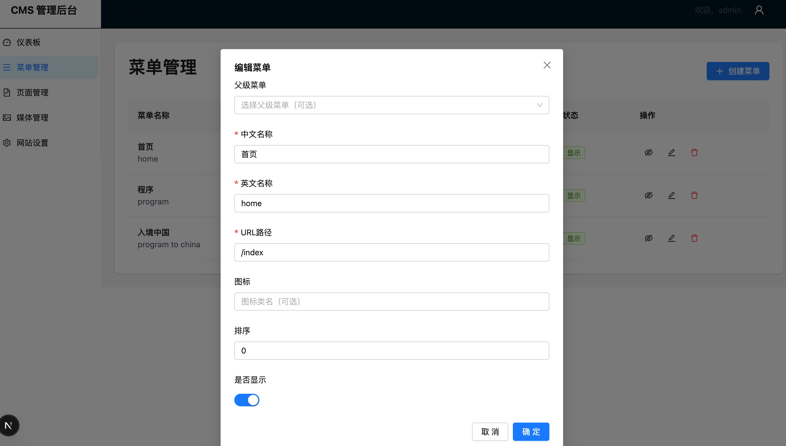
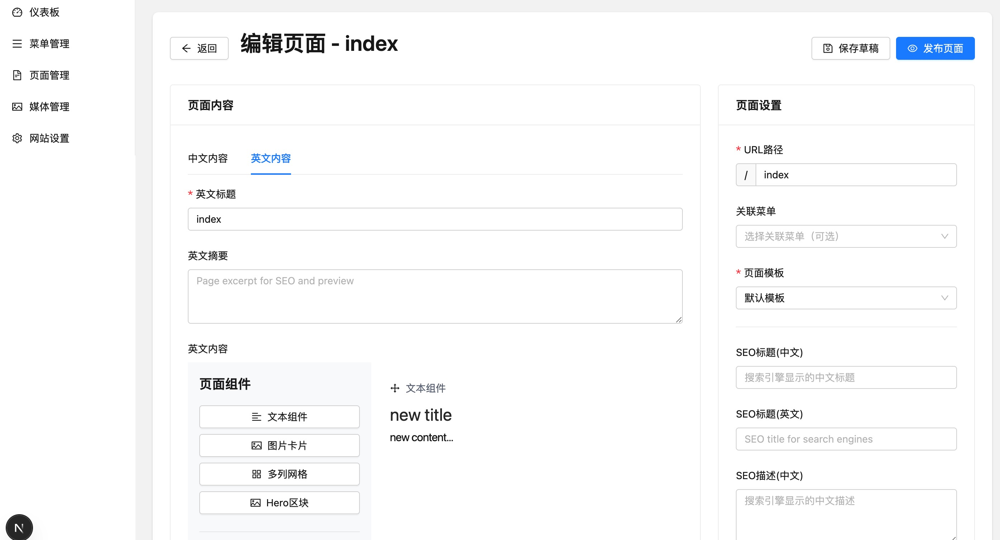
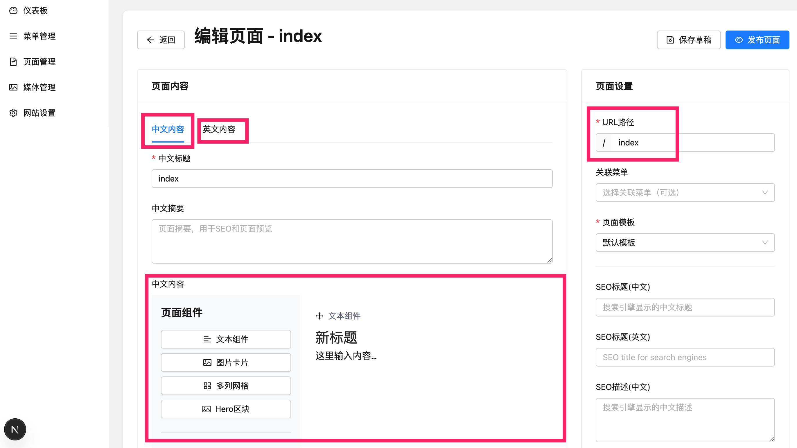
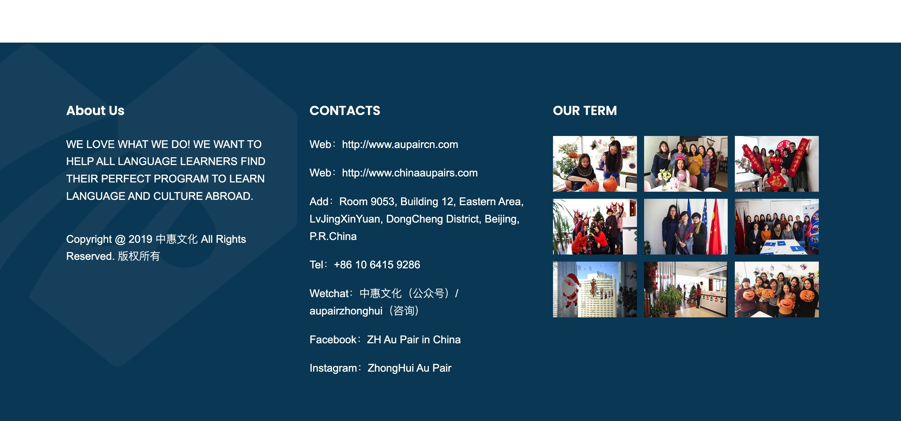
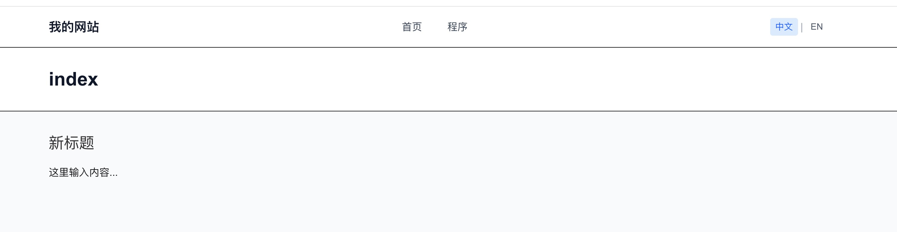
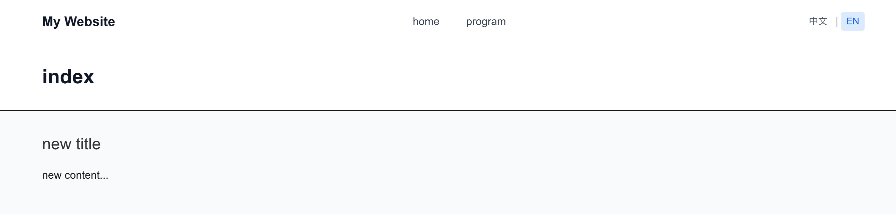

## 后台管理系统
### 管理员登陆
### 前台菜单配置

- 每个菜单需要同时配置中英文
- 每个菜单配置一个页面地址
- 菜单最大3级
  

### 前台页面配置

- 每个页面需要同时配置中英文内容
- 页面内容可以上传图片 并配文
- 配置后可以生成前台展示页面
- 网站首页也可以编辑

### 配置邮箱
- 用于用户邮件与我们联系

### 配置网站级别设置

- 标题
- 页面底部固定内容（如公司信息等）

## 前台展示系统
### 菜单栏

- 加载后台配置的菜单
- 有中英文切换的按钮，点击按钮后切换对应的语言的菜单

### 页面展示

- 点中英文切换按钮后切换成后台配置的对应语言的内容
- 页面布局由后台编辑生成

